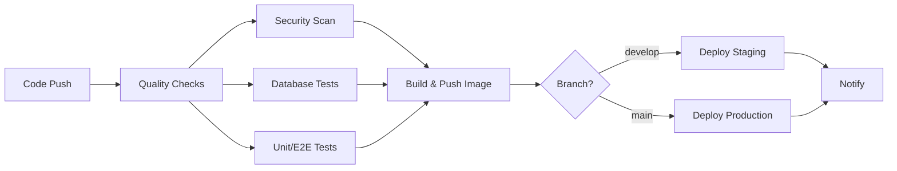

# 🚀 CI/CD & Deployment Guide

This document outlines the complete CI/CD pipeline and deployment process for the NestJS Enterprise API.

## 📋 Table of Contents

- [CI/CD Pipeline Overview](#-cicd-pipeline-overview)
- [Workflows](#-workflows)
- [Docker Setup](#-docker-setup)
- [Deployment](#-deployment)
- [Monitoring & Maintenance](#-monitoring--maintenance)

## 🔄 CI/CD Pipeline Overview

The project uses GitHub Actions for automated CI/CD with the following stages:



## 🔧 Workflows

### Main CI/CD Pipeline (`.github/workflows/ci-cd.yml`)

**Triggers:**

- Push to `main` or `develop` branches
- Pull requests to `main` or `develop`
- Manual workflow dispatch

**Jobs:**

1. **Quality** - Code formatting, linting, type checking
2. **Database** - Migration tests and schema validation
3. **Tests** - Unit tests with coverage, E2E tests
4. **Security** - Dependency audit, CodeQL analysis
5. **Build** - Docker image build and push to registry
6. **Deploy** - Environment-specific deployment
7. **Notify** - Deployment status notifications

### Release Workflow (`.github/workflows/release.yml`)

**Triggers:**

- Git tags matching `v*.*.*` pattern
- Manual dispatch with version input

**Features:**

- Automatic changelog generation
- Multi-platform Docker images (amd64, arm64)
- GitHub release creation
- Semantic versioning support

### Dependency Updates (`.github/workflows/dependency-updates.yml`)

**Schedule:**

- Runs every Monday at 9 AM UTC
- Automatic security audits
- Creates PRs for dependency updates

### Cleanup (`.github/workflows/cleanup.yml`)

**Schedule:**

- Runs every Sunday at 2 AM UTC
- Removes old container images
- Cleans up old artifacts

## 🐳 Docker Setup

### Development

```bash
# Start development environment
docker-compose up -d

# View logs
docker-compose logs -f
```

### Production

```bash
# Start production stack
docker-compose -f docker-compose.prod.yml up -d

# View application logs
docker-compose -f docker-compose.prod.yml logs -f app
```

### Image Structure

```dockerfile
# Multi-stage build for optimization
FROM node:18-alpine AS base
FROM base AS deps
FROM base AS build
FROM node:18-alpine AS production
```

**Security Features:**

- Non-root user execution
- Minimal Alpine Linux base
- Health checks included
- Resource limits configured

## 🚀 Deployment

### Prerequisites

1. **Environment Variables**

   ```bash
   cp .env.example.production .env.production
   # Edit .env.production with your values
   ```

2. **SSL Certificates** (for HTTPS)
   ```bash
   mkdir ssl
   # Place cert.pem and key.pem in ssl/ directory
   ```

### Deployment Methods

#### Method 1: Automated Deployment (Recommended)

```bash
# Production deployment script
./scripts/deploy/deploy.sh

# Rollback if needed
./scripts/deploy/rollback.sh
```

#### Method 2: Manual Deployment

```bash
# Pull latest image
docker pull ghcr.io/ahmed-shehzad/nestjs_demo:latest

# Deploy with docker-compose
docker-compose -f docker-compose.prod.yml up -d --force-recreate

# Run migrations
docker-compose -f docker-compose.prod.yml exec app npm run prisma:migrate:deploy
```

#### Method 3: Container Orchestration

```bash
# Kubernetes (example)
kubectl apply -f k8s/

# Docker Swarm (example)
docker stack deploy -c docker-compose.prod.yml nestjs-app
```

### Environment-Specific Deployments

#### Staging Environment

- **Branch:** `develop`
- **URL:** `https://staging.your-domain.com`
- **Auto-deploy:** On push to develop branch

#### Production Environment

- **Branch:** `main`
- **URL:** `https://your-domain.com`
- **Auto-deploy:** On push to main branch
- **Manual approval:** Required for production

### Rollback Strategy

1. **Automatic Rollback**

   ```bash
   ./scripts/deploy/rollback.sh
   ```

2. **Manual Rollback**

   ```bash
   # Restore from backup
   docker-compose exec postgres psql -U postgres -d nest < backup.sql

   # Use previous image
   docker-compose -f docker-compose.prod.yml up -d
   ```

## 📊 Monitoring & Maintenance

### Health Checks

**Application Health**

```bash
curl http://localhost:3000/health
```

**Container Health**

```bash
docker ps --format "table {{.Names}}\t{{.Status}}"
```

### Log Management

**View Application Logs**

```bash
docker-compose logs -f app
```

**Database Logs**

```bash
docker-compose logs -f postgres
```

**Nginx Logs**

```bash
docker-compose logs -f nginx
```

### Backup & Recovery

**Automated Backups**

- Database backups created before each deployment
- Stored in `./backups/` directory
- Retention: 30 days

**Manual Backup**

```bash
docker-compose exec postgres pg_dump -U postgres nest > backup_$(date +%Y%m%d).sql
```

**Restore from Backup**

```bash
docker-compose exec postgres psql -U postgres -d nest < backup_file.sql
```

### Security

**Container Security**

- Non-root user execution
- Read-only root filesystem
- Resource limits
- Health checks

**Network Security**

- Private network for containers
- HTTPS termination at Nginx
- Rate limiting configured
- Security headers included

**Secrets Management**

- Environment variables for secrets
- No secrets in images or code
- GitHub Secrets for CI/CD

### Performance Optimization

**Docker Image**

- Multi-stage builds
- Layer caching
- Minimal base images

**Application**

- Connection pooling
- Gzip compression
- Static asset caching

**Database**

- Connection pooling
- Query optimization
- Regular maintenance

## 🛠️ Troubleshooting

### Common Issues

**Database Connection Issues**

```bash
# Check database status
docker-compose ps postgres

# View database logs
docker-compose logs postgres

# Test connection
docker-compose exec app npm run prisma:db:pull
```

**Image Build Failures**

```bash
# Clear Docker cache
docker builder prune -f

# Rebuild without cache
docker build --no-cache .
```

**Deployment Failures**

```bash
# Check deployment logs
docker-compose logs -f

# Rollback to previous version
./scripts/deploy/rollback.sh

# Check resource usage
docker stats
```

### Debug Mode

**Enable Debug Logging**

```bash
# Set environment variable
LOG_LEVEL=debug

# Restart containers
docker-compose restart
```

**Connect to Running Container**

```bash
docker-compose exec app sh
```

## 📚 Additional Resources

- [GitHub Actions Documentation](https://docs.github.com/en/actions)
- [Docker Compose Documentation](https://docs.docker.com/compose/)
- [Nginx Configuration Guide](https://nginx.org/en/docs/)
- [PostgreSQL Documentation](https://www.postgresql.org/docs/)

---

**Need help?** Check the troubleshooting section or create an issue in the repository.
